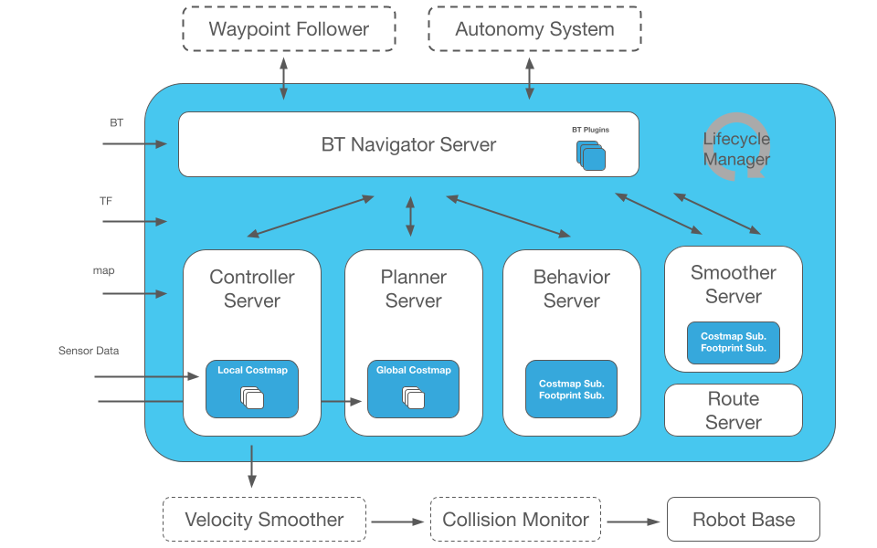
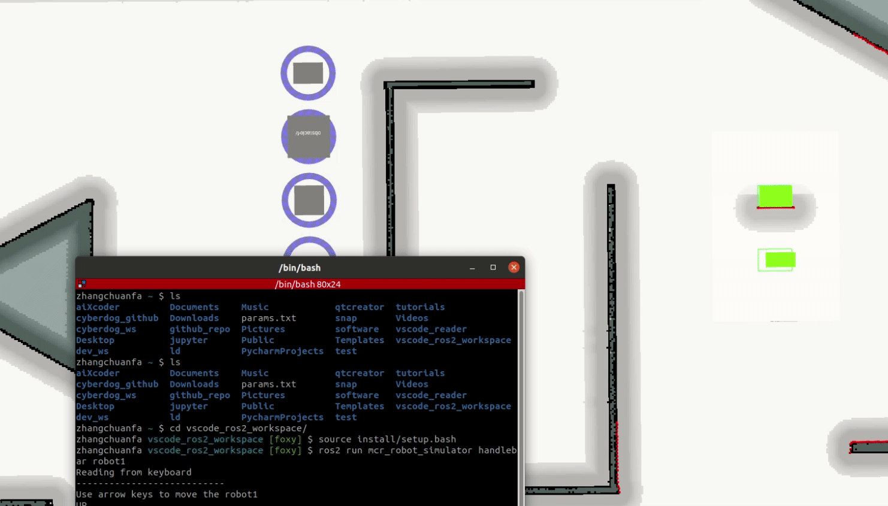
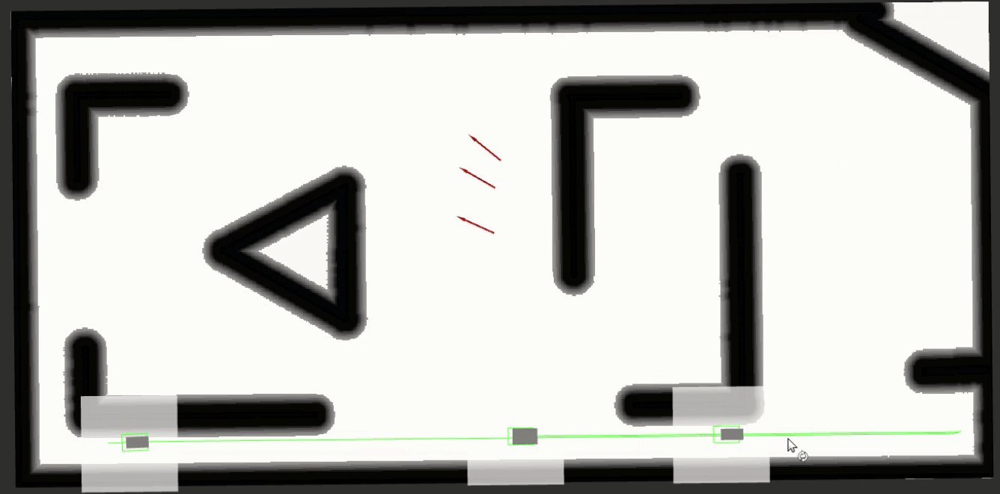
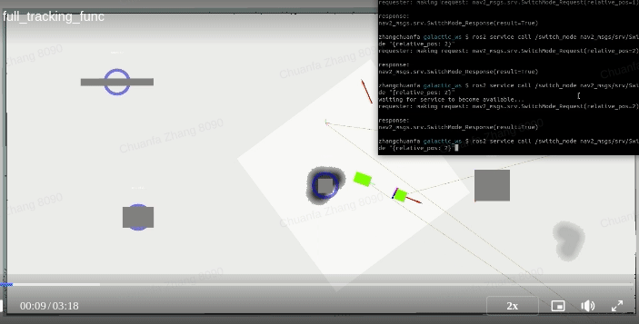

# 仿真器概述

## 引言

    工欲善其事 必先利其器

文档通篇致力于实现一个简单高效的仿真工具，用于2D移动机器人的导航功能开发

在完成前面环境安装与开发环境搭建之后，正式进入仿真器阶段。在本小节，首先从仿真器到底在仿什么进行切入，尽可能的讲清楚即将实现的仿真器所拥有的模块，以及模块之间的关系。

## 什么是仿真器

仿真器： 一个通过计算机技术与建模技术所构建出来的虚拟的，可视化的，用于节约开发成本的工具。

## 仿真器与实体机器人

主要通过机器人与仿真器之间的类比，来筛选出仿真器所需要的最小功能集合。

### 真实的机器人架构

### 导航算法功能架构

- Functional modules and relationships in simulator

||||
|---|---|---|
|robot|teleop|map|
|clock|tf| odometry|
|velocity|obstacle|perception||
| detection| visulization||

map
robot && pose
Goal pose
Visulization
tf tree
velocity
odometry
obstacles
perception

## Nav Simulator

- 虚拟时钟（时间）
- 地图（空间）
- 坐标系（关系）
- 机器人（演员）
- 遥控器（剧本）
- 里程计（）
- 障碍物（道具）
- 传感器（）
- 目标检测
- 可视化

## 仿真器的基本原理

介绍仿真器的基本工作原理和技术。
包括物理引擎、传感器模拟、动力学模型等方面的内容。

## ROS 仿真器的使用场景

通过上面所描述的仿真系统，后续可以完成如下的基础功能：
### 遥控器

### 路径规划

### 机器人导航仿真

## ROS 仿真器的进阶功能
结合ros中的命名空间设计，可以完成进阶的功能仿真：
### 多机器人导航仿真

### 机器人跟随

## 总结

概述仿真器在机器人ROS开发中的重要性和应用。并将仿真器的最小功能集进行筛选解释，后续会逐步实现每个模块，最终组合成一个完整的导航仿真系统。