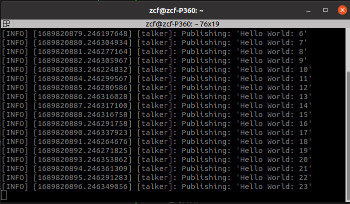
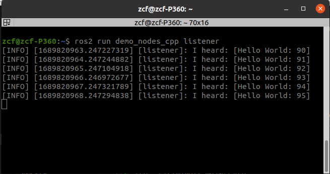

# 环境安装


## 引言

&nbsp;&nbsp;&nbsp;&nbsp;为了帮助读者快速开始使用ROS，并确保他们在正确的环境中配置和安装ROS系统与书中所使用的环境保持一致。在这一小节对ROS环境安装以及navigation2的安装进行学习。

&nbsp;&nbsp;&nbsp;&nbsp;将环境安装单独安排一个章节进行描述，可以帮助零基础读者迅速了解ROS的安装流程和基本要求。对于有相关基础的环境的读者可以在不浪费时间的情况下快速调到下一个章节，了解ROS系统的基本结构和功能。

&nbsp;&nbsp;&nbsp;&nbsp;ROS的安装和配置可能涉及多个步骤和依赖项。通过提供详细的安装指导，确保读者能够正确配置ROS环境，避免因配置错误而导致的问题和不必要的麻烦。

&nbsp;&nbsp;&nbsp;&nbsp;本小节的内容主要来自ROS2的Wiki，以及navigation2的wiki。会在下方贴出相关站点链接，英文功底扎实的同学可以直接前往官方文档进行安装后，跳过本小节。

均建议使用二进制安装包进行环境配置：

```
ROS2（galactic）：   https://docs.ros.org/en/galactic/Installation/Ubuntu-Install-Debians.html

navigation2（galactic）：    https://navigation.ros.org/getting_started/index.html#installation
```

## 操作系统和ROS版本

&nbsp;&nbsp;&nbsp;&nbsp;书中使用的操作系统为 ubuntu 20.04

&nbsp;&nbsp;&nbsp;&nbsp;ROS2版本为galactic

&nbsp;&nbsp;&nbsp;&nbsp;尽量避免虚拟机的形式安装ubuntu，可以考虑安装双系统。或者直接安排ubuntu系统在开发的PC上。(具体双系统怎么装，就不在此罗列了)

&nbsp;&nbsp;&nbsp;&nbsp;安装顺序是先安装完成ROS，再进行navigation2的功能包安装。

## 安装ROS

详细介绍在所选操作系统上安装ROS的步骤。
包括添加ROS软件源、使用包管理器安装ROS核心软件包、设置ROS环境变量等。

`apt install` 是在 Ubuntu 或 Debian 等 Linux 系统中用于安装软件包的命令。其安装流程如下：

1. 更新软件包列表：首先，系统会检查软件包列表是否过时，如果是，则会从软件源服务器下载最新的软件包列表。

2. 搜索软件包：接下来，系统会根据你提供的软件包名称在软件包列表中搜索匹配项。

3. 解析依赖关系：如果找到了匹配的软件包，系统将检查该软件包的依赖关系，以确定它是否需要其他软件包来正常运行。如果需要，系统将自动下载并安装这些依赖项。

4. 下载软件包：一旦解析了所有依赖关系，系统将从软件源服务器上下载相应的软件包文件。

5. 安装软件包：下载完成后，系统会将软件包文件解压并安装到正确的目录中。

6. 配置软件包：一些软件包在安装后需要进行一些配置。系统将执行这些配置步骤，以确保软件能够正常运行。

7. 完成安装：一旦所有步骤都成功完成，`apt install` 命令就会结束，并且软件包现在已经安装在你的系统中。

请注意，为了执行 `apt install` 命令，你需要具有管理员权限，通常通过在命令前加上 `sudo` 来获得。例如：`sudo apt install 软件包名称`。

### 设置语言环境

```
# 用于显示计算机当前的本地化（locale）设置，包括语言、字符编码等相关信息。
locale  # check for UTF-8
# 命令组合,用于更新包列表以确保软件包信息是最新的。接着装 locales 软件包，该软件包提供设置本地化的工具和文件。
sudo apt update && sudo apt install locales
# 生成 en_US 和 en_US.UTF-8 两种本地化，其中 en_US.UTF-8 表示以 UTF-8 字符编码的英语本地化
sudo locale-gen en_US en_US.UTF-8
# 更新系统的本地化设置，将 LC_ALL 和 LANG 设置为 en_US.UTF-8，即将系统的所有本地化相关配置都设为以 UTF-8 字符编码的英语本地化。
sudo update-locale LC_ALL=en_US.UTF-8 LANG=en_US.UTF-8
# 设置当前会话（session）的 LANG 环境变量为 en_US.UTF-8，这样当前会话中所有使用 locale 的程序都将遵循 UTF-8 编码的英语本地化
export LANG=en_US.UTF-8
# 验证刚刚配置的本地化设置是否生效
locale  # verify settings
```
执行这些命令后，计算机的本地化设置将被更新为以 UTF-8 字符编码的英语本地化。UTF-8 是一种支持全球多种字符的编码方式，这意味着计算机可以正确处理和显示包括中文、日文、俄文等非ASCII字符的文本和应用程序。通过配置 UTF-8 的本地化，确保系统能够正确处理不同字符集的文本，从而提高了多语言支持和国际化能力。这对于跨语言环境下的计算机和软件来说非常重要。
### 设置软件源

将apt软件仓库添加到系统中
```
# 安装软件包"software-properties-common"。"software-properties-common" 是一个包含常用软件源管理工具的软件包。通过安装它，你可以使用诸如 "add-apt-repository" 这样的命令来添加、删除和管理软件源，方便地进行软件安装和更新。
sudo apt install software-properties-common
# 添加 "universe" 软件源到你的系统中。在 Ubuntu 系统中，软件源分为 "main"、"restricted"、"universe" 和 "multiverse" 四个组件，其中 "universe" 组件包含了许多自由且开源的软件包，但不受官方支持。通过添加 "universe" 软件源，你可以访问更多的软件包，扩展系统的软件选择范围。
sudo add-apt-repository universe
```
添加 "universe" 软件源，你可以访问更多的自由且开源的软件包，增加了系统软件选择的可能性。

添加 ROS2的GPG密钥
```
# 更新计算机中的软件包列表。它会检查当前系统所配置的软件源，并获取最新的软件包信息，但不会安装或更新实际的软件包。
# 安装 curl 工具。curl 是一个用于执行网络请求的强大工具，它可以用于下载文件，访问API等。安装 curl 后，你就可以在终端中使用 curl 命令。
sudo apt update && sudo apt install curl
# 下载 ROS 密钥文件，并将其保存到 /usr/share/keyrings/ros-archive-keyring.gpg 文件中。密钥文件是ROS软件源的认证文件，用于确保从ROS软件源下载的软件包是可信的。
sudo curl -sSL https://raw.githubusercontent.com/ros/rosdistro/master/ros.key -o /usr/share/keyrings/ros-archive-keyring.gpg
```
通过使用 ROS 的认证密钥，用户可以确保下载的 ROS 软件包是来自官方软件源的，不会被篡改或植入恶意代码。这有助于提高软件包的安全性和可靠性，保障了 ROS 系统的稳定运行和开发环境的安全性

然后将软件源添加到系统源列表中
```
echo "deb [arch=$(dpkg --print-architecture) signed-by=/usr/share/keyrings/ros-archive-keyring.gpg] http://packages.ros.org/ros2/ubuntu $(. /etc/os-release && echo $UBUNTU_CODENAME) main" | sudo tee /etc/apt/sources.list.d/ros2.list > /dev/null
```
- 将 ROS 2 软件源的地址写入到 /etc/apt/sources.list.d/ros2.list 文件中。在 Ubuntu 和 Debian 等 Linux 系统中，软件包管理器（APT）会从 /etc/apt/sources.list 和 /etc/apt/sources.list.d/ 目录下的文件读取软件源的信息，以确定从哪些位置下载软件包。
- 通过写入 ROS 2 软件源的地址，系统的软件包管理器就能知道要从哪里获取 ROS 2 相关的软件包和更新。
- ROS 2 软件源地址中包含了之前下载的 ROS 公钥文件的路径 /usr/share/keyrings/ros-archive-keyring.gpg，这样软件包管理器在下载软件包时，会使用这个公钥来验证软件包的合法性，以确保下载的软件包是来自 ROS 官方软件源的，不会被篡改或植入恶意代码。
通过这些步骤，用户就可以成功添加 ROS 2 软件源，从而可以通过软件包管理器安装 ROS 2 相关的软件包和更新，从而进行 ROS 2 的开发和运行。### 安装ROS2的功能包

完成软件源设置之后更新apt仓库的缓存
```
sudo apt update
```

检查已安装软件包的更新，并将可用的更新版本下载并安装到系统中
```
sudo apt upgrade
```

推荐安装Desktop版本，其包括了一系列可视化工具和示例程序
```
sudo apt install ros-galactic-desktop
```
安装开发工具：编译器和其他构建ROS包的工具
```
sudo apt install ros-dev-tools
```

### 设置环境变量
安装位置一般会位于/opt/ros/galactic/目录
```
# Replace ".bash" with your shell if you're not using bash
# Possible values are: setup.bash, setup.sh, setup.zsh
source /opt/ros/galactic/setup.bash
```

### ROS2环境验证
打开一个terminal，运行如下指令：
```
source /opt/ros/galactic/setup.bash
ros2 run demo_nodes_cpp talker
```


打开另一个terminal，运行如下指令：
```
source /opt/ros/galactic/setup.bash
ros2 run demo_nodes_py listener
```


&nbsp;&nbsp;&nbsp;&nbsp;如果两个终端的指令执行和输出显示均如图所示，那么说明ROS2的环境已经安装OK，可以进行下一步的navigation2功能包的安装。

### ROS2卸载
&nbsp;&nbsp;&nbsp;&nbsp;如果决定退坑不玩儿了，可以选择保留环境或者卸载环境，卸载时按照如下指令执行即可。
卸载ROS2相关软件包
```
sudo apt remove ~nros-galactic-* && sudo apt autoremove
```
删除ROS2相关的软件源
```
sudo rm /etc/apt/sources.list.d/ros2.list
sudo apt update
sudo apt autoremove
# Consider upgrading for packages previously shadowed.
sudo apt upgrade
```

## 安装navigation2

&nbsp;&nbsp;&nbsp;&nbsp;在保证ROS2环境安装并配置成功之后，就可以进行navigation2的功能包安装了。

### 安装
安装Nav2相关的功能包
```
sudo apt install ros-galactic-navigation2
sudo apt install ros-galactic-nav2-bringup
```

安装Turtlebot3仿真包
```
sudo apt install ros-galactic-turtlebot3-gazebo
```

### 功能验证
打开一个terminal，执行如下指令设置所需要的环境变量
```
source /opt/ros/galactic/setup.bash
export TURTLEBOT3_MODEL=waffle
export GAZEBO_MODEL_PATH=$GAZEBO_MODEL_PATH:/opt/ros/galactic/share/turtlebot3_gazebo/models
```

然后执行如下指令
```
ros2 launch nav2_bringup tb3_simulation_launch.py headless:=False
```

如果能看到如下效果图，那么说明navigation2的功能包安装成功。


&nbsp;&nbsp;&nbsp;&nbsp;第一次启动功能，可能会由于gazebo模型加载需要等的久一些。但是我们这本书就是要写一个替代gazebo的仿真器来进行导航功能验证，所以如果实在无法启动  只要前面安装过程都是顺利无报错的，也不影响后续内容的进行。

## 常见安装问题和解决方法
```
source /opt/ros/galactic/setup.bash
```
执行如上指令，是为了设置ROS2相关的环境变量。如果环境里只会用到刚安装的这一ROS版本，那么可以使用下面的指令，将该步骤写入到.bashrc中，避免每次启动终端都要先运行如上的source指令了。
```
echo  'source /opt/ros/galactic/setup.bash' >> ~/.bashrc 
```

&nbsp;&nbsp;&nbsp;&nbsp;在安装过程中，不可避免的会遇到一些奇奇怪怪的问题，要学会善于利用搜索工具，google或者baidu，还有ros社区等。

&nbsp;&nbsp;&nbsp;&nbsp;如果后续我建立沟通交流渠道的话，也可以在沟通群里寻求伙伴的帮助。

## 总结

&nbsp;&nbsp;&nbsp;&nbsp;成功安装和配置ROS环境和navigation2功能栈。

